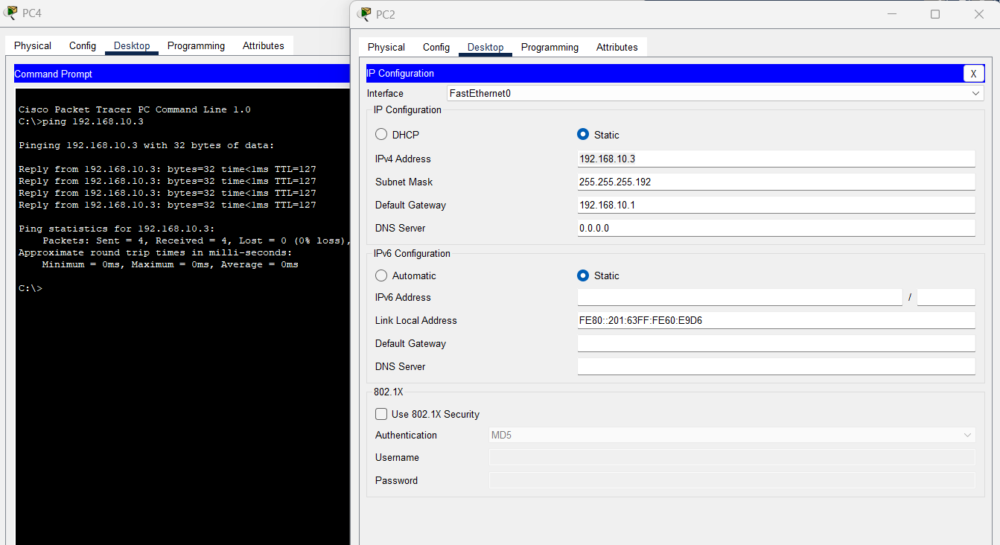

| Zona | VLAN | Hosts req. | Criticidad / por qué |
|------|------|------------|----------------------|
| Zona 1 — Paseo Cayalá (comercial/gastronómica) | 17 | 60 | Alto tráfico — más tiendas y restaurantes, mayor cantidad de usuarios simultáneos |
| Zona 2 — Administración (edificio municipal) | 27 | 28 | Crítica — gestión central del complejo |
| Zona 3 — Seguridad (garitas / CCTV) | 37 | 12 | Crítica aunque pequeña — vigilancia 24/7, no puede perder conectividad |
| Zona 4 — Residencial (Lirios de Cayalá) | 47 | 50 | Muchos hosts pero no es administración/seguridad/alto-tráfico comercial → criticidad moderada |
| Zona 5 — Hotelera (AC Marriott) | 57 | 7 | La más pequeña, menor criticidad relativa |


----

# Swich central o Core

```cisco
enable
configure terminal
hostname SW-CORE-CAYALA

vtp domain 202200057
vtp password CayalaNet2026
vtp mode server
vtp version 2

vlan 17
 name COMERCIAL
vlan 27
 name ADMINISTRACION
vlan 37
 name SEGURIDAD
vlan 47
 name RESIDENCIAL
vlan 57
 name HOTELERA
vlan 99
 name NATIVA
vlan 999
 name BLACKHOLE
exit

spanning-tree mode rapid-pvst
```

## Enrutamiento inter-VLAN
```cisco
ip routing

interface vlan 17
ip address 192.168.10.1 255.255.255.192
no shutdown

interface vlan 47
ip address 192.168.10.65 255.255.255.192
no shutdown

interface vlan 27
ip address 192.168.10.129 255.255.255.224
no shutdown

interface vlan 37
ip address 192.168.10.161 255.255.255.240
no shutdown

interface vlan 57
ip address 192.168.10.177 255.255.255.240
no shutdown
```

- Red -------- .0   .64   .128   .160 . 176
- Gateway:--- .1 .65 .129 .161 .177
- Brodcast----  .63 .127 .159 .175 .191

| VLAN | Máscara | Por qué |
|------|---------|---------|
| 17 (60 hosts) | 255.255.255.192 (/26) | bloque de 64 IPs |
| 47 (50 hosts) | 255.255.255.192 (/26) | bloque de 64 IPs |
| 27 (28 hosts) | 255.255.255.224 (/27) | bloque de 32 IPs |
| 37 (12 hosts) | 255.255.255.240 (/28) | bloque de 16 IPs |
| 57 (7 hosts) | 255.255.255.240 (/28) | bloque de 16 IPs |


## Configuracion modo Trunk
```cisco
enable
configure terminal
interface range FastEthernet0/1 - 2
 switchport trunk encapsulation dot1q
 switchport mode trunk
 switchport trunk native vlan 99
 switchport trunk allowed vlan 17,99
 channel-group 1 mode desirable


interface FastEthernet0/3
 switchport trunk encapsulation dot1q
 switchport mode trunk
 switchport trunk native vlan 99
 switchport trunk allowed vlan 27,99

interface FastEthernet0/4
 switchport trunk encapsulation dot1q
 switchport mode trunk
 switchport trunk native vlan 99
 switchport trunk allowed vlan 27,99

interface FastEthernet0/5
 switchport trunk encapsulation dot1q
 switchport mode trunk
 switchport trunk native vlan 99
 switchport trunk allowed vlan 37,99

interface FastEthernet0/6
 switchport trunk encapsulation dot1q
 switchport mode trunk
 switchport trunk native vlan 99
 switchport trunk allowed vlan 37,99

interface FastEthernet0/7
 switchport trunk encapsulation dot1q
 switchport mode trunk
 switchport trunk native vlan 99
 switchport trunk allowed vlan 47,99

interface FastEthernet0/8
 switchport trunk encapsulation dot1q
 switchport mode trunk
 switchport trunk native vlan 99
 switchport trunk allowed vlan 57,99


- Puertos 999
interface range FastEthernet0/9 - 24
 switchport mode access
 switchport access vlan 999
 shutdown

 --- Verficar ---
show interfaces trunk
show etherchannel summary
```

-
-
-


----
# Switch 1 - Comercio
```cisco
enable
configure terminal
hostname SW-Z1

vtp domain 202200057
vtp password CayalaNet2026
vtp mode client

spanning-tree mode rapid-pvst
spanning-tree vlan 17 priority 4096

------------------------------------

interface range FastEthernet0/1 - 2
 switchport trunk encapsulation dot1q
 switchport mode trunk
 switchport trunk native vlan 99
 switchport trunk allowed vlan 17,99
 channel-group 1 mode desirable

interface range FastEthernet0/3 - 6
 switchport mode access
 switchport access vlan 17

interface range FastEthernet0/7 - 24
 switchport mode access
 switchport access vlan 999
 shutdown

--- Verificar ---
show vtp status
show vlan brief
show interfaces trunk
show etherchannel summary


```


# Switch Zona 2 Administracion

```cisco
enable
configure terminal
hostname SW-Z2

vtp domain 202200057
vtp password CayalaNet2026
vtp mode client

spanning-tree mode rapid-pvst
spanning-tree vlan 27 priority 4096

interface range FastEthernet0/1 - 2
 switchport trunk encapsulation dot1q
 switchport mode trunk
 switchport trunk native vlan 99
 switchport trunk allowed vlan 27,99

interface range FastEthernet0/3 - 6
 switchport mode access
 switchport access vlan 27

interface range FastEthernet0/7 - 24
 switchport mode access
 switchport access vlan 999
 shutdown
```


# Switch Zona 3 Seguridad

```cisco
enable
configure terminal
hostname SW-Z3

vtp domain 202200057
vtp password CayalaNet2026
vtp mode client

spanning-tree mode rapid-pvst
spanning-tree vlan 37 priority 4096

interface range FastEthernet0/1 - 2
 switchport trunk encapsulation dot1q
 switchport mode trunk
 switchport trunk native vlan 99
 switchport trunk allowed vlan 37,99

interface range FastEthernet0/3 - 6
 switchport mode access
 switchport access vlan 37

interface range FastEthernet0/7 - 24
 switchport mode access
 switchport access vlan 999
 shutdown
```


# Swich Zona 4 Residencial
```cisco
enable
configure terminal
hostname SW-Z4
!
vtp domain 202200057
vtp password CayalaNet2026
vtp mode client
!
spanning-tree mode rapid-pvst
spanning-tree vlan 47 priority 4096
!
interface FastEthernet0/1
 switchport trunk encapsulation dot1q
 switchport mode trunk
 switchport trunk native vlan 99
 switchport trunk allowed vlan 47,99
!
interface range FastEthernet0/2 - 4
 switchport mode access
 switchport access vlan 47
!
interface range FastEthernet0/5 - 24
 switchport mode access
 switchport access vlan 999
 shutdown
 ```


# Switch Zona 5 Hotelera 
 ```
enable
configure terminal
hostname SW-Z5

vtp domain 202200057
vtp password CayalaNet2026
vtp mode client

spanning-tree mode rapid-pvst
spanning-tree vlan 57 priority 4096

interface FastEthernet0/1
 switchport trunk encapsulation dot1q
 switchport mode trunk
 switchport trunk native vlan 99
 switchport trunk allowed vlan 57,99

interface range FastEthernet0/2 - 3
 switchport mode access
 switchport access vlan 57

interface range FastEthernet0/4 - 24
 switchport mode access
 switchport access vlan 999
 shutdown
  ```
  

# Asignacion de IPs

| PC | Zona | IP | Máscara | Gateway |
|----|------|----|---------|---------|
| PC1 | Comercio (17) | 192.168.10.2 | 255.255.255.192 | 192.168.10.1 |
| PC2 | Comercio (17) | 192.168.10.3 | 255.255.255.192 | 192.168.10.1 |
| PC3 | Comercio (17) | 192.168.10.4 | 255.255.255.192 | 192.168.10.1 |
| PC14 | Comercio (17) | 192.168.10.5 | 255.255.255.192 | 192.168.10.1 |
| PC4 | Admin (27) | 192.168.10.130 | 255.255.255.224 | 192.168.10.129 |
| PC5 | Admin (27) | 192.168.10.131 | 255.255.255.224 | 192.168.10.129 |
| PC6 | Admin (27) | 192.168.10.132 | 255.255.255.224 | 192.168.10.129 |
| PC7 | Seguridad (37) | 192.168.10.162 | 255.255.255.240 | 192.168.10.161 |
| PC8 | Seguridad (37) | 192.168.10.163 | 255.255.255.240 | 192.168.10.161 |
| PC9 | Residencial (47) | 192.168.10.66 | 255.255.255.192 | 192.168.10.65 |
| PC10 | Residencial (47) | 192.168.10.67 | 255.255.255.192 | 192.168.10.65 |
| PC11 | Residencial (47) | 192.168.10.68 | 255.255.255.192 | 192.168.10.65 |
| PC12 | Hotelera (57) | 192.168.10.178 | 255.255.255.240 | 192.168.10.177 |
| PC13 | Hotelera (57) | 192.168.10.179 | 255.255.255.240 | 192.168.10.177 |


# Pruebas de ping

| Desde | Comando | Pasa por |
|-------|---------|----------|
| PC4 (Admin) | ping 192.168.10.2 (PC1, Comercio) | SVI 27 → Core → SVI 17 |
| PC4 (Admin) | ping 192.168.10.162 (PC7, Seguridad) | SVI 27 → Core → SVI 37 |
| PC4 (Admin) | ping 192.168.10.66 (PC9, Residencial) | SVI 27 → Core → SVI 47 |
| PC4 (Admin) | ping 192.168.10.178 (PC12, Hotelera) | SVI 27 → Core → SVI 57 |
| PC7 (Seguridad) | ping 192.168.10.130 (PC4, Admin) | al revés, para confirmar ida y vuelta |


# Pruebas

Existe etherchannel (SW-Z1 o Core)
- show etherchannel summary

VTP 
- `show vtp status` (Core: modo Server - zonas: modo Client)
- `show vlan brief` (En cada zona verifica las vlans)

TRUNK
- `show interfaces trunk` (Las Vlans de cada zona y nativa)

Spanning Tree / root bridge
- `show spanning-tree vlan 17` (SW-Z1 debe ser root)
- `show spanning-tree vlan 27` y `37` (en el Core: un puerto Root/FWD y el otro Altn/BLK)

Blackhole
- `show vlan brief` (puertos sin uso en la VLAN 999)
- `show interfaces status` (puertos sin uso en `disabled`)

Conectividad
- `ping` entre PCs de la misma zona
- `ping` entre PCs de zonas distintas

---
# Estándar de cableado

Se utilizó el estándar **TIA/EIA-568B** para todo el cableado de cobre (UTP).

- **Straight-through (directo):** ambos extremos con el orden T568B.
- **Crossover (cruzado):** un extremo en T568B y el otro en T568A (se intercambian los pares naranja y verde).

Orden de colores T568B: blanco/naranja, naranja, blanco/verde, azul, blanco/azul, verde, blanco/café, café.

## Regla aplicada

| Tipo de enlace | Cable | Justificación |
|---|---|---|
| Switch ↔ PC | Straight-through | Dispositivos de distinto tipo: la PC transmite por los pines 1-2 y el switch recibe por ellos. |
| Switch ↔ Switch | Crossover | Dispositivos del mismo tipo: ambos transmiten por los mismos pines, por lo que hay que cruzar los pares. |

## Cableado de la topología

| Enlace | Cantidad | Cable |
|---|---|---|
| Core ↔ SW-Z1 (Zona 1) | 2 | Crossover |
| Core ↔ SW-Z2 (Zona 2) | 2 | Crossover |
| Core ↔ SW-Z3 (Zona 3) | 2 | Crossover |
| Core ↔ SW-Z4 (Zona 4) | 1 | Crossover |
| Core ↔ SW-Z5 (Zona 5) | 1 | Crossover |
| SW-Zx ↔ PCs | 14 | Straight-through |

Total: 8 cables crossover y 14 straight-through

# Imagenes

### Topologia general


### Trunk desde Switch central


### Uso del BlackHole


### Prueba de ping entre zonas (Gateway)
prueba Z2 hacia Z1


### Ping en la misma zona


Informacion general del cableado por zona 
### Topologia general
