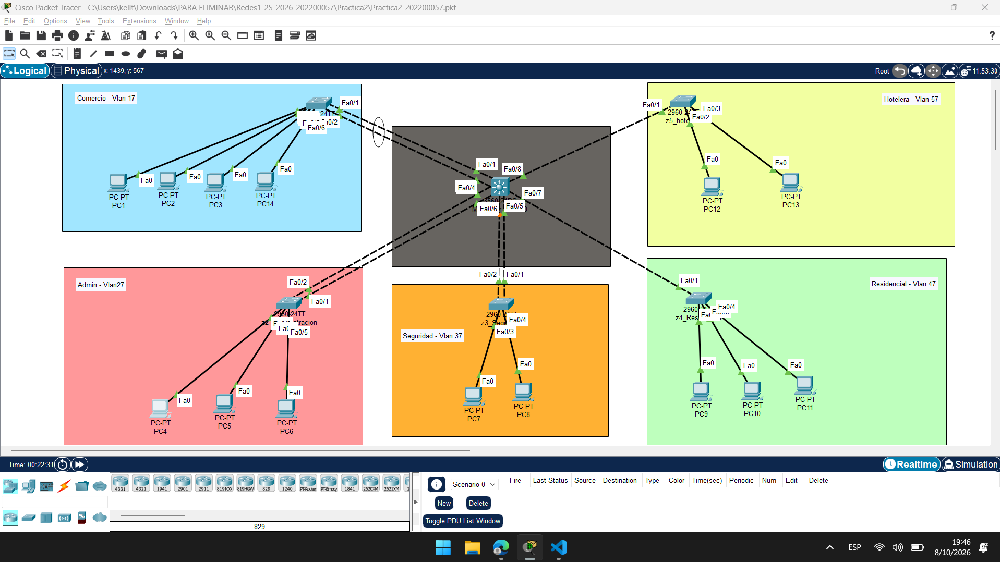
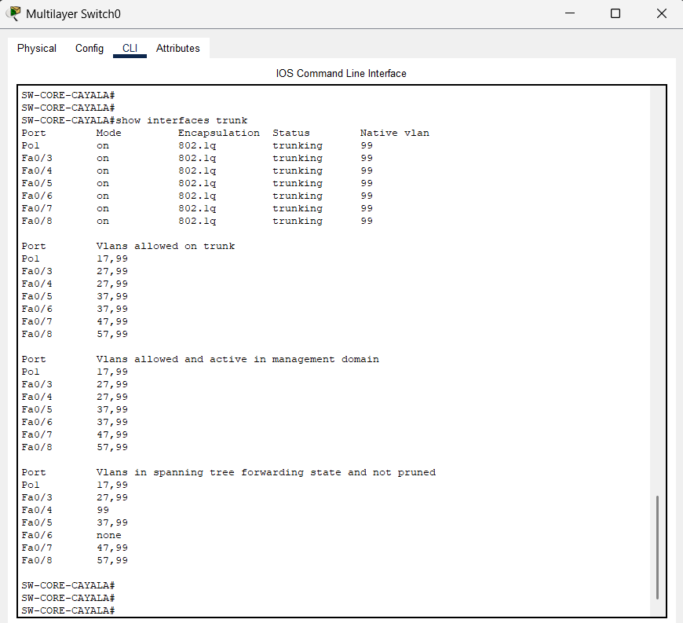
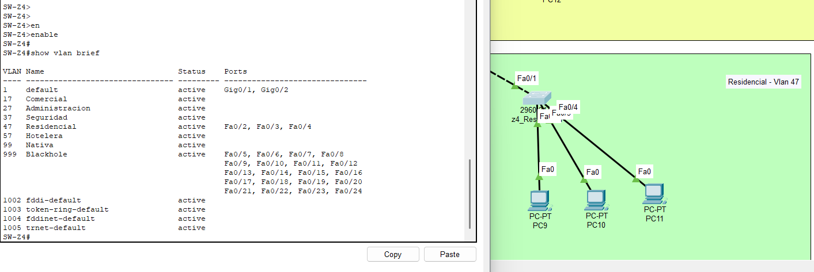
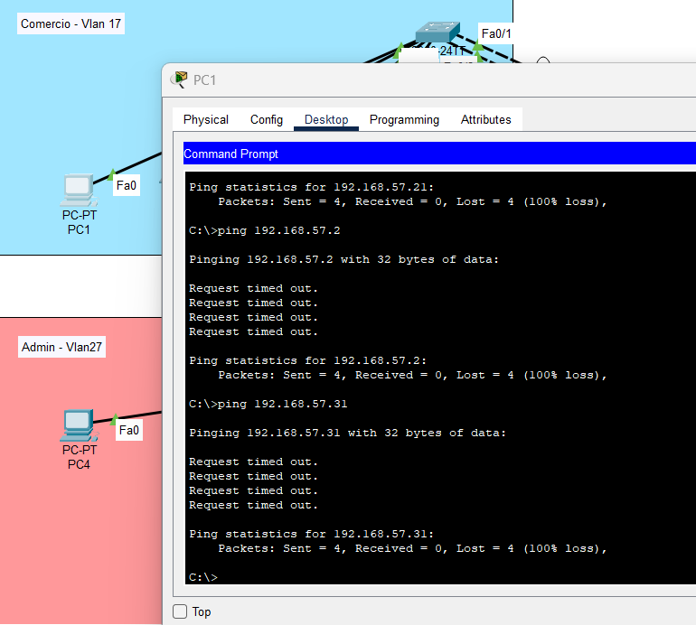
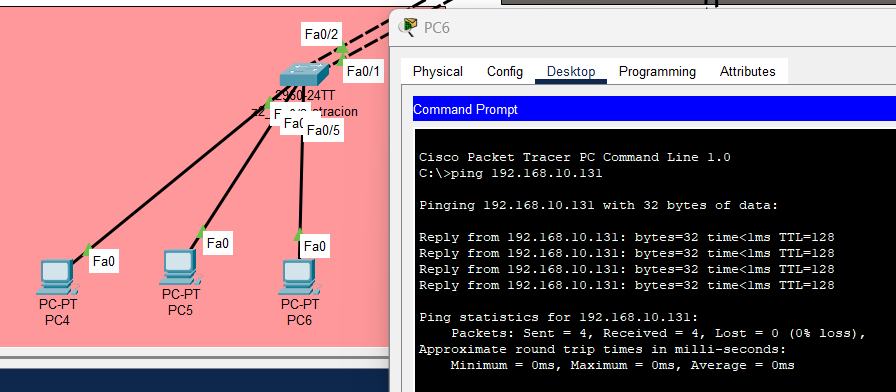
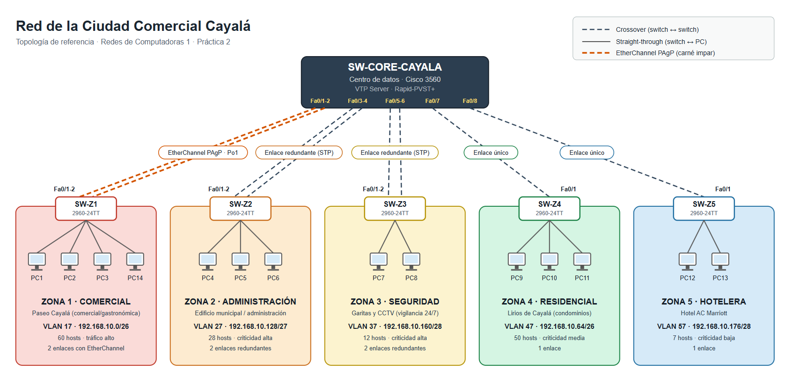

| Zona | VLAN | Hosts req. | Criticidad / por qué |
|------|------|------------|----------------------|
| Zona 1 — Paseo Cayalá (comercial/gastronómica) | 17 | 60 | Alto tráfico — más tiendas y restaurantes, mayor cantidad de usuarios simultáneos |
| Zona 2 — Administración (edificio municipal) | 27 | 28 | Crítica — gestión central del complejo |
| Zona 3 — Seguridad (garitas / CCTV) | 37 | 12 | Crítica aunque pequeña — vigilancia 24/7, no puede perder conectividad |
| Zona 4 — Residencial (Lirios de Cayalá) | 47 | 50 | Muchos hosts pero no es administración/seguridad/alto-tráfico comercial → criticidad moderada |
| Zona 5 — Hotelera (AC Marriott) | 57 | 7 | La más pequeña, menor criticidad relativa |


----

# Swich central o Core

```cisco
enable
configure terminal
hostname SW-CORE-CAYALA

vtp domain 202200057
vtp password CayalaNet2026
vtp mode server
vtp version 2

vlan 17
 name COMERCIAL
vlan 27
 name ADMINISTRACION
vlan 37
 name SEGURIDAD
vlan 47
 name RESIDENCIAL
vlan 57
 name HOTELERA
vlan 99
 name NATIVA
vlan 999
 name BLACKHOLE
exit

spanning-tree mode rapid-pvst
```


## Configuracion modo Trunk
```cisco
enable
configure terminal
interface range FastEthernet0/1 - 2
 switchport trunk encapsulation dot1q
 switchport mode trunk
 switchport trunk native vlan 99
 switchport trunk allowed vlan 17,99
 channel-group 1 mode desirable


interface FastEthernet0/3
 switchport trunk encapsulation dot1q
 switchport mode trunk
 switchport trunk native vlan 99
 switchport trunk allowed vlan 27,99

interface FastEthernet0/4
 switchport trunk encapsulation dot1q
 switchport mode trunk
 switchport trunk native vlan 99
 switchport trunk allowed vlan 27,99

interface FastEthernet0/5
 switchport trunk encapsulation dot1q
 switchport mode trunk
 switchport trunk native vlan 99
 switchport trunk allowed vlan 37,99

interface FastEthernet0/6
 switchport trunk encapsulation dot1q
 switchport mode trunk
 switchport trunk native vlan 99
 switchport trunk allowed vlan 37,99

interface FastEthernet0/7
 switchport trunk encapsulation dot1q
 switchport mode trunk
 switchport trunk native vlan 99
 switchport trunk allowed vlan 47,99

interface FastEthernet0/8
 switchport trunk encapsulation dot1q
 switchport mode trunk
 switchport trunk native vlan 99
 switchport trunk allowed vlan 57,99


- Puertos 999
interface range FastEthernet0/9 - 24
 switchport mode access
 switchport access vlan 999
 shutdown

 --- Verficar ---
show interfaces trunk
show etherchannel summary
```


----
# Switch 1 - Comercio
```cisco
enable
configure terminal
hostname SW-Z1

vtp domain 202200057
vtp password CayalaNet2026
vtp mode client

spanning-tree mode rapid-pvst
spanning-tree vlan 17 priority 4096

------------------------------------

interface range FastEthernet0/1 - 2
 switchport trunk encapsulation dot1q
 switchport mode trunk
 switchport trunk native vlan 99
 switchport trunk allowed vlan 17,99
 channel-group 1 mode desirable

interface range FastEthernet0/3 - 6
 switchport mode access
 switchport access vlan 17

interface range FastEthernet0/7 - 24
 switchport mode access
 switchport access vlan 999
 shutdown

--- Verificar ---
show vtp status
show vlan brief
show interfaces trunk
show etherchannel summary


```


# Switch Zona 2 Administracion

```cisco
enable
configure terminal
hostname SW-Z2

vtp domain 202200057
vtp password CayalaNet2026
vtp mode client

spanning-tree mode rapid-pvst
spanning-tree vlan 27 priority 4096

interface range FastEthernet0/1 - 2
 switchport trunk encapsulation dot1q
 switchport mode trunk
 switchport trunk native vlan 99
 switchport trunk allowed vlan 27,99

interface range FastEthernet0/3 - 6
 switchport mode access
 switchport access vlan 27

interface range FastEthernet0/7 - 24
 switchport mode access
 switchport access vlan 999
 shutdown
```


# Switch Zona 3 Seguridad

```cisco
enable
configure terminal
hostname SW-Z3

vtp domain 202200057
vtp password CayalaNet2026
vtp mode client

spanning-tree mode rapid-pvst
spanning-tree vlan 37 priority 4096

interface range FastEthernet0/1 - 2
 switchport trunk encapsulation dot1q
 switchport mode trunk
 switchport trunk native vlan 99
 switchport trunk allowed vlan 37,99

interface range FastEthernet0/3 - 6
 switchport mode access
 switchport access vlan 37

interface range FastEthernet0/7 - 24
 switchport mode access
 switchport access vlan 999
 shutdown
```


# Swich Zona 4 Residencial
```cisco
enable
configure terminal
hostname SW-Z4
!
vtp domain 202200057
vtp password CayalaNet2026
vtp mode client
!
spanning-tree mode rapid-pvst
spanning-tree vlan 47 priority 4096
!
interface FastEthernet0/1
 switchport trunk encapsulation dot1q
 switchport mode trunk
 switchport trunk native vlan 99
 switchport trunk allowed vlan 47,99
!
interface range FastEthernet0/2 - 4
 switchport mode access
 switchport access vlan 47
!
interface range FastEthernet0/5 - 24
 switchport mode access
 switchport access vlan 999
 shutdown
 ```


# Switch Zona 5 Hotelera 
 ```
enable
configure terminal
hostname SW-Z5

vtp domain 202200057
vtp password CayalaNet2026
vtp mode client

spanning-tree mode rapid-pvst
spanning-tree vlan 57 priority 4096

interface FastEthernet0/1
 switchport trunk encapsulation dot1q
 switchport mode trunk
 switchport trunk native vlan 99
 switchport trunk allowed vlan 57,99

interface range FastEthernet0/2 - 3
 switchport mode access
 switchport access vlan 57

interface range FastEthernet0/4 - 24
 switchport mode access
 switchport access vlan 999
 shutdown
  ```
  

# Asignacion de IPs
| Zona | PC | IP |
|------|----|----|
| Comercio (17) | PC1, PC2, PC3, PC14 | 192.168.57.11, .12, .13, .14 |
| Admin (27) | PC4, PC5, PC6 | 192.168.57.21, .22, .23 |
| Seguridad (37) | PC7, PC8 | 192.168.57.31, .32 |
| Residencial (47) | PC9, PC10, PC11 | 192.168.57.41, .42, .43 |
| Hotelera (57) | PC12, PC13 | 192.168.57.51, .52 |

# Pruebas de ping

| Pruebas | | |
|---------|--|--|
| **Desde** | **Hacia** | **Resultado esperado** |
| PC4 (.21) | PC5 (.22), misma zona | Exitoso |
| PC1 (.11) | PC2 (.12), misma zona | Exitoso |
| PC4 (.21) | PC1 (.11), otra zona | Falla (Request timed out) |
| PC7 (.31) | PC9 (.41), otra zona | Falla |


# Pruebas

Existe etherchannel (SW-Z1 o Core)
- show etherchannel summary

VTP 
- `show vtp status` (Core: modo Server - zonas: modo Client)
- `show vlan brief` (En cada zona verifica las vlans)

TRUNK
- `show interfaces trunk` (Las Vlans de cada zona y nativa)

Spanning Tree / root bridge
- `show spanning-tree vlan 17` (SW-Z1 debe ser root)
- `show spanning-tree vlan 27` y `37` (en el Core: un puerto Root/FWD y el otro Altn/BLK)

Blackhole
- `show vlan brief` (puertos sin uso en la VLAN 999)
- `show interfaces status` (puertos sin uso en `disabled`)

Conectividad
- `ping` entre PCs de la misma zona
- `ping` entre PCs de zonas distintas

---
# Estándar de cableado

Se utilizó el estándar **TIA/EIA-568B** para todo el cableado de cobre (UTP).

- **Straight-through (directo):** ambos extremos con el orden T568B.
- **Crossover (cruzado):** un extremo en T568B y el otro en T568A (se intercambian los pares naranja y verde).

Orden de colores T568B: blanco/naranja, naranja, blanco/verde, azul, blanco/azul, verde, blanco/café, café.

## Regla aplicada

| Tipo de enlace | Cable | Justificación |
|---|---|---|
| Switch ↔ PC | Straight-through | Dispositivos de distinto tipo: la PC transmite por los pines 1-2 y el switch recibe por ellos. |
| Switch ↔ Switch | Crossover | Dispositivos del mismo tipo: ambos transmiten por los mismos pines, por lo que hay que cruzar los pares. |

## Cableado de la topología

| Enlace | Cantidad | Cable |
|---|---|---|
| Core ↔ SW-Z1 (Zona 1) | 2 | Crossover |
| Core ↔ SW-Z2 (Zona 2) | 2 | Crossover |
| Core ↔ SW-Z3 (Zona 3) | 2 | Crossover |
| Core ↔ SW-Z4 (Zona 4) | 1 | Crossover |
| Core ↔ SW-Z5 (Zona 5) | 1 | Crossover |
| SW-Zx ↔ PCs | 14 | Straight-through |

Total: 8 cables crossover y 14 straight-through

# Imagenes

### Topologia general


### Trunk desde Switch central


### Uso del BlackHole


### Prueba de ping entre zonas (No funciona)
prueba de Pc1 En z1 hacia Z2 y Z3 no funcionan


### Ping en la misma zona


Informacion general del cableado por zona 
### Topologia general

