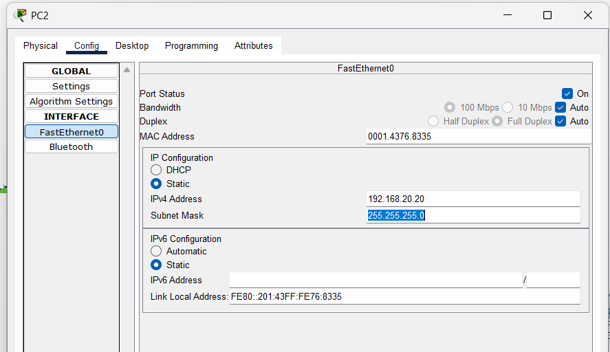
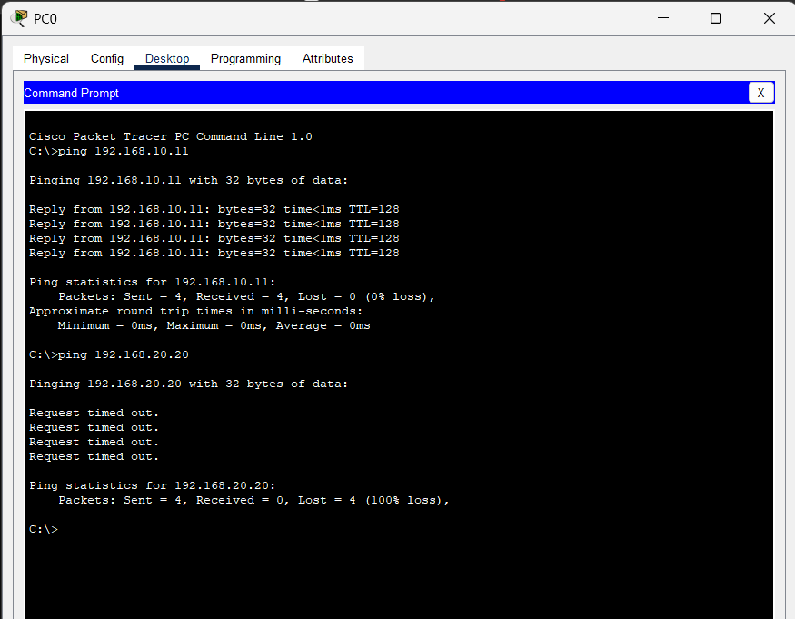
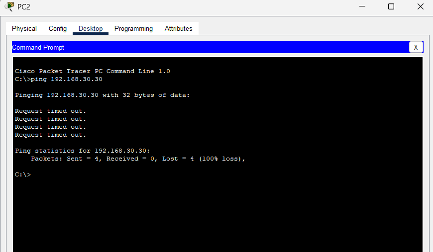
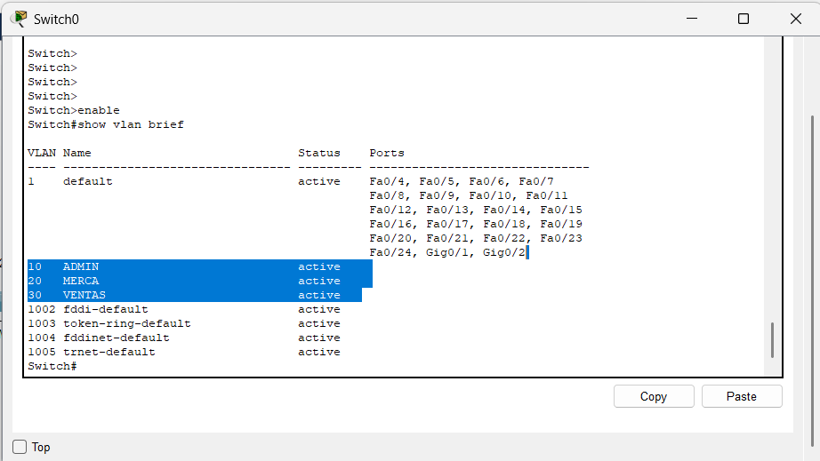
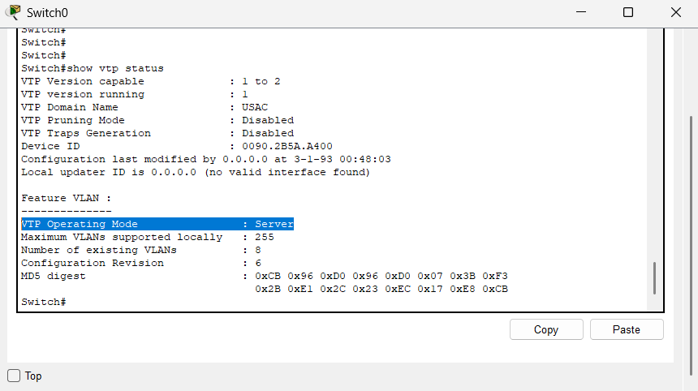
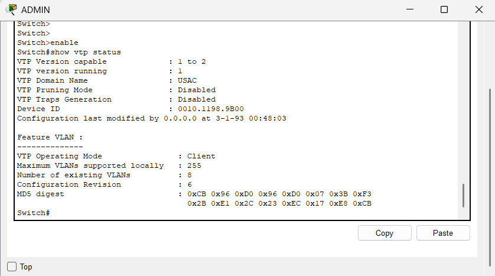
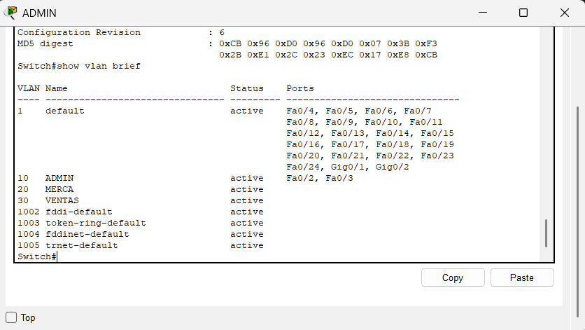
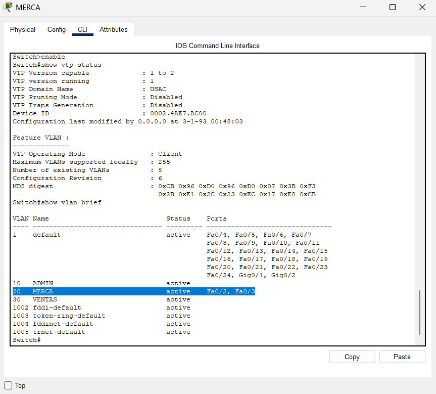
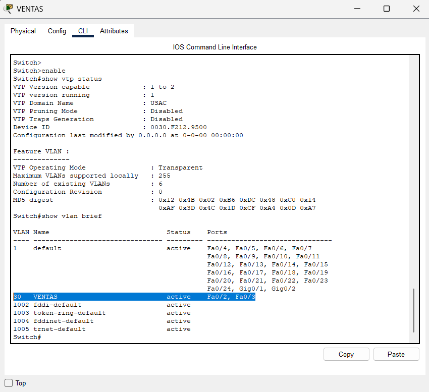

## CONFIGURACION DE MODO TRUNK 

- Switch> enable
- Switch# configure terminal (enter)

###  Configurar hacia MERCA
- Switch(config)# interface fa0/1
- Switch(config)# switchport mode trunk
- Switch(config)# exit

### Configurar hacia ADMIN
- Switch(config)# interface fa0/2
- Switch(config)# switchport mode trunk
- Switch(config)# exit

###  Configurar hacia VENTAS
- Switch(config)# interface fa0/3
- Switch(config)# switchport mode trunk
- Switch(config)# exit

###  Verificar el modo trunk
- Switch#show interfaces trunk

## CONFIGURACION VTP SERVER (Desde Swich0)
- Switch>enable
- Switch#configure terminal (enter)
- Switch(config)#vtp domain USAC       
- Switch(config)#vtp password redes
- Switch(config)#vtp mode server

## CONFIGURACION VTP CLIENTE (Desde ADMIN Y MERCA )
- Switch>enable
- Switch#configure terminal (enter)
- Switch(config)#vtp domain USAC       
- Switch(config)#vtp password redes
- Switch(config)#vtp mode client

## CONFIGURACION VTP TRANSPARENT (Desde VENTAS )
- Switch>enable
- Switch#configure terminal (enter)
- Switch(config)#vtp domain USAC       
- Switch(config)#vtp password redes
- Switch(config)#vtp mode transparent

---
### Verificar la configuracion vtp
- Switch(config)# exit
- Switch# show vtp status

   -  "VTP Operating Mode                : Server"
--- 

# CREACION DE VLANS

desde el swich0 

- Switch>enable
- Switch#configure terminal (enter)
---
- Switch(config)#vlan 10
- Switch(config-vlan)#name ADMIN
- Switch(config-vlan)#exit
---
- Switch(config)#vlan 20
- Switch(config-vlan)#name MERCA
- Switch(config-vlan)#exit
---
- Switch(config)#vlan 30
- Switch(config-vlan)#name VENTAS
- Switch(config-vlan)#exit

### Verificar vlans 
- Switch# show vlan brief

## CONFIGURAR LAS IP 

En cada una de las pc se establece la direccion IP correspondiente a su vlan es decir
- vlan 10 = 192.168.10.1x
- vlan 20 = 192.168.20.2x
- vlan 30 = 192.168.30.3x

## CONFIGURAR VLAN SWITCH - PC

### Configuracion ADMIN
- Switch#configure terminal (enter)
- Switch(config)#interface fa0/2 
- Switch(config-if)#switchport mode access
- Switch(config-if)#switchport access vlan 10
- Switch(config-if)#exit

----
- Switch#configure terminal (enter)
- Switch(config)#interface fa0/3
- Switch(config-if)#switchport mode access
- Switch(config-if)#switchport access vlan 10
- Switch(config-if)#exit
---
Verificar que esten configuradas las vlan 
- Switch#show vlan brief

   - "10   ADMIN                            active    Fa0/2, Fa0/3" 

-----
### Configuracion MERCA
- Switch#configure terminal (enter)
- Switch(config)#interface fa0/2 
- Switch(config-if)#switchport mode access
- Switch(config-if)#switchport access vlan 20
- Switch(config-if)#exit

----
- Switch#configure terminal (enter)
- Switch(config)#interface fa0/3
- Switch(config-if)#switchport mode access
- Switch(config-if)#switchport access vlan 20
- Switch(config-if)#exit
---
Verificar que esten configuradas las vlan 
- Switch#show vlan brief

   - "20   MERCA                            active    Fa0/2, Fa0/3

   -----
### Configuracion VENTAS
- Switch#configure terminal (enter)
- Switch(config)#interface fa0/2 
- Switch(config-if)#switchport mode access
- Switch(config-if)#switchport access vlan 30
- Switch(config-if)#exit

----
- Switch#configure terminal (enter)
- Switch(config)#interface fa0/3
- Switch(config-if)#switchport mode access
- Switch(config-if)#switchport access vlan 30
- Switch(config-if)#exit
---
Verificar que esten configuradas las vlan 
- Switch#show vlan brief

   - "30   VENTAS                           active    Fa0/2, Fa0/3"
---
### GUARDAR LA MEMORIA 
En cada uno de los swich utilizar el comando
- Switch# write memory
---
# PRUEBAS DE PING

En estas pruebas corroboramos como las pc de la misma vlan si se comunican mientras que las que tienen vlan distinta no tienen comunicacion 

Exito - Error

Error

---
Vista general de la topografia utilizada

---
Vlan desde switch0

---
Configuracion vtp del switch0

---
Configuracion vtp del ADMIN 

---
Configuracion vlan del ADMIN 

---
Configuracion general de MERCA

---
Configuracion general de VENTAS

